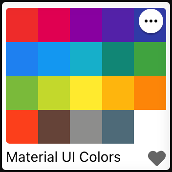
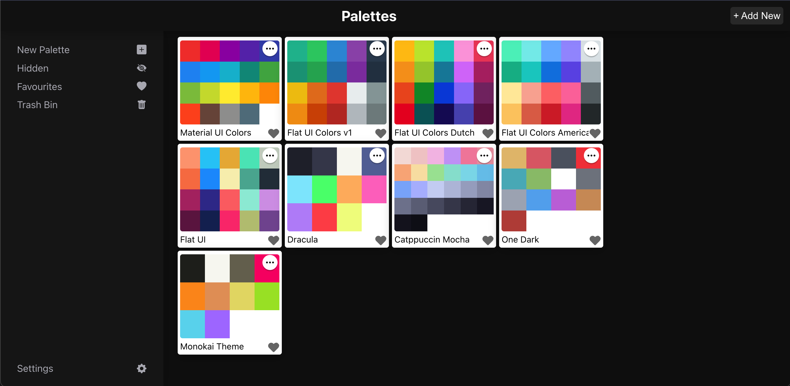

# React Colors

A modern color palette management application built with React and TypeScript.

<p align="center">
  
</p>

## Description

React Colors is a web application that allows users to create, manage, and explore color palettes. It provides an intuitive interface for working with colors, including features like copying color values, exploring color shades, and organizing palettes.

## Live Demo

Check out the live application: [React Colors](https://devallabharath.github.io/React-Colors)

## Features

- Create and manage custom color palettes
- Copy color values in different formats
- Explore color shades
- Responsive design for all devices
- Dynamic text color based on background luminance
- Drag and drop interface for organizing colors
- Delete and restore palettes
- Hide/show palettes
- Favorites management

## Installation

1. Clone the repository:
   ```
   git clone https://github.com/devallabharath/React-Colors.git
   cd React-Colors
   ```

2. Install dependencies:
   ```
   npm install
   ```

3. Start the development server:
   ```
   npm start
   ```

4. Open [http://localhost:3000](http://localhost:3000) to view it in the browser.

## Building for Production

```
npm run build
```

This builds the app for production to the `build` folder.

## Deployment

The application is configured for deployment to GitHub Pages:

```
npm run deploy
```

## Technologies Used

- React 18
- TypeScript
- React Router
- chroma-js (for color manipulation)
- Shoelace components
- rc-slider
- react-sortable-hoc
- nanoid

## Project Structure

- `/src/components`: Reusable UI components
- `/src/pages`: Application pages/views
- `/src/styles`: CSS stylesheets
- `/src/utils`: Utility functions and type definitions
- `/src/App.tsx`: Main application component
- `/src/routes.tsx`: Application routing

## License

This project is open source and available under the [MIT License](LICENSE).

## Author

[Devalla Bharath](https://github.com/devallabharath)